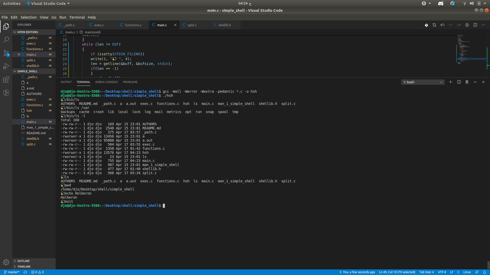
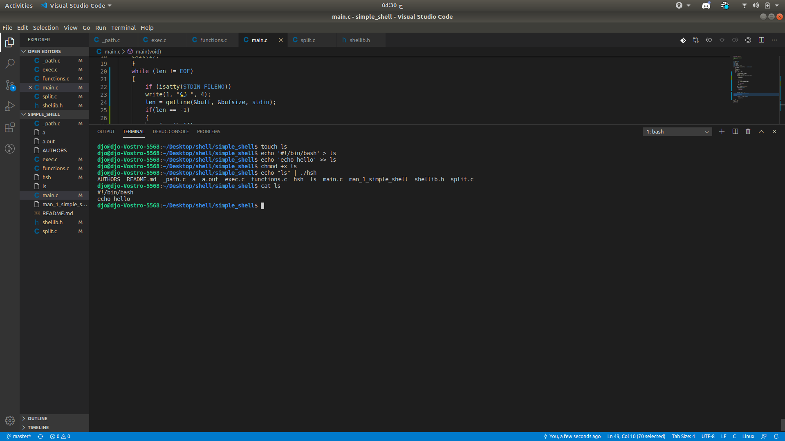

# simple_shell
Command Line basic commands
When working with Git from the command line, you will need to use more than just the Git commands. There are several basic commands that you should learn, in order to make full use of the command line.

Start working on your project
To work on a Git project locally (from your own computer), with the command line, first you will need to clone (copy) it to your computer.

Working with files on the command line
This section has examples of some basic shell commands that you might find useful. For more information, search the web for bash commands.

Alternatively, you can edit files using your choice of editor (IDE), or the GitLab user interface (not locally).

Common commands
The list below is not exhaustive, but contains many of the most commonly used commands.

Command	Description
ls	List what’s in the current directory
ls a*	List what’s in the current directory that starts with a
ls *.md	List what’s in the current directory that ends with .md
mkdir NAME-OF-YOUR-DIRECTORY	Create a new directory
cat README.md	Display the contents of a text file you created previously
pwd	Show the current directory
Create a text file in the current directory
To create a text file from the command line, for example README.md, follow these steps:
# You can use this for compiler
```
gcc -Wall -Werror -Wextra -pedantic -std=gnu89 *.c -o hsh
```
# And then Type
```
./hsh
```
#

#

## Authors

See also the list of the authos who participated in this project in the [AUTHORS](AUTHORS) file.

